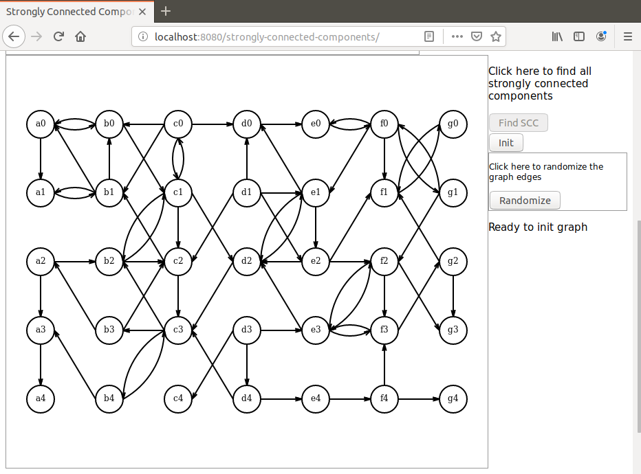
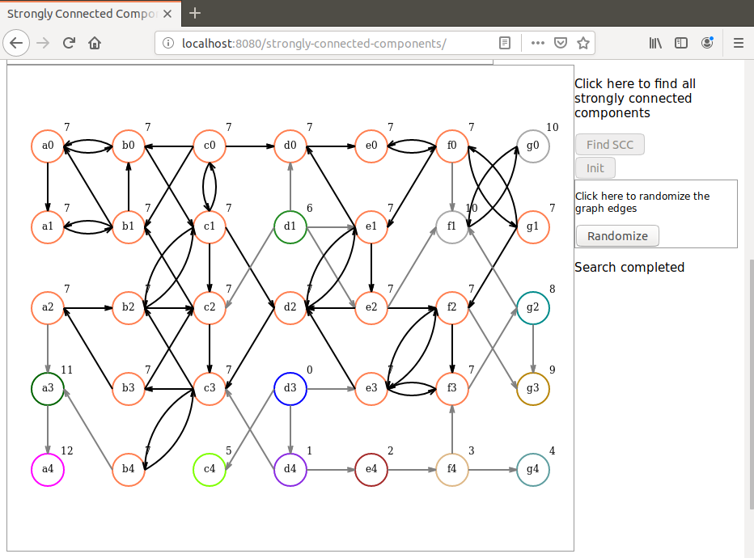

# Strongly-connected-components
I present here a Java based demonstration of a Strongly Connected Components algorithm that uses a Depth First Search algorithm.

The algorithm itself is implemented in Java. Javascript is used for random initialization and display on Canvas only.

# Launching the demo
To launch the demo run the command `mvn spring-boot:run` in project directory. When the application has started open a browser and hit URL `localhost:8080/strongly-connected-components`.

Here are some screen shots that can be seen during the demo:

After the graph was initialized:

After all strongly connected components are found:

Dominique Ubersfeld, Cachan, France

